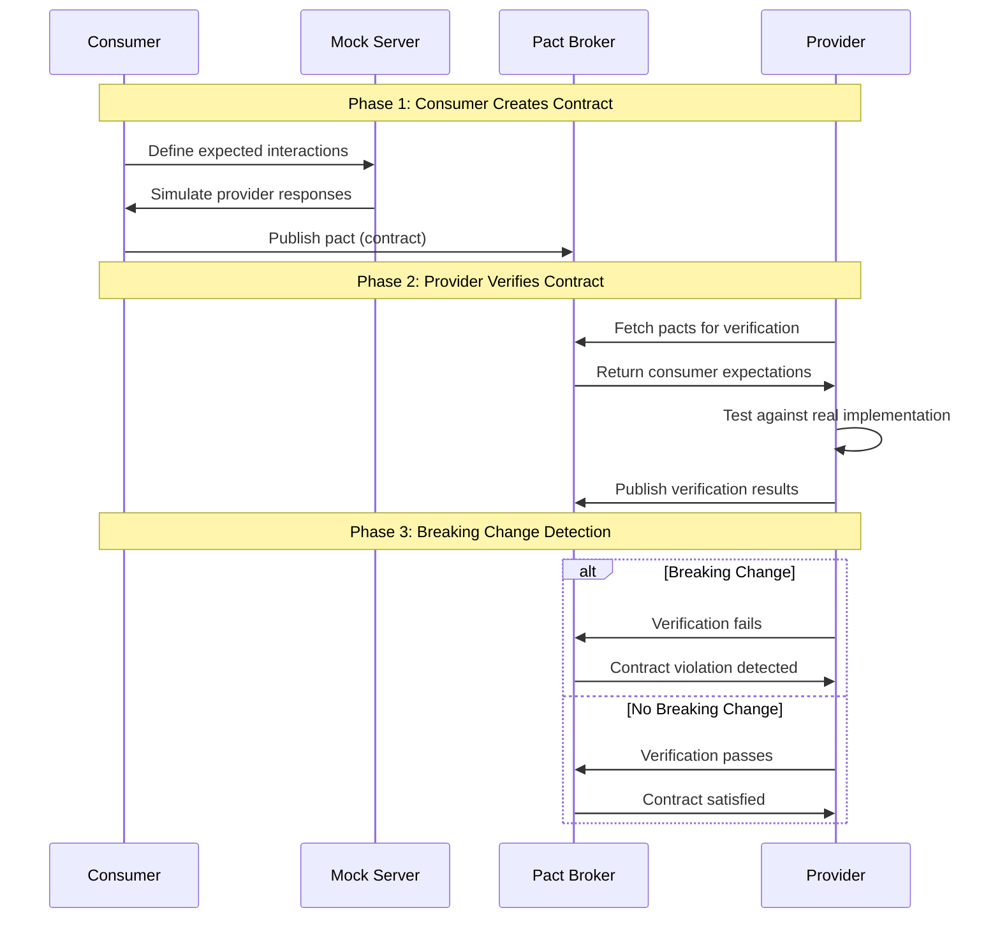

# Contract Testing with Pact

A comprehensive example demonstrating Consumer-Driven Contract Testing using Pact in Python with FastAPI and aiohttp.

## What is Contract Testing?

Contract testing is a technique for testing the integration points between services (consumers and providers) by verifying that both sides of the contract are compatible. Unlike integration tests that test the entire system, contract tests focus on the **interface** between services.

### Why Contract Testing?

- **Early Detection**: Catch breaking changes before they reach production
- **Confidence**: Refactor with confidence knowing contracts will catch issues
- **Documentation**: Contracts serve as living documentation of API expectations
- **Consumer-Driven**: The consumer drives what the API should look like

## How Pact Testing Works

### 1. Consumer-Driven Approach

```
┌─────────────────┐    Defines Expectations    ┌─────────────────┐
│   Consumer      │ ─────────────────────────► │   Pact Broker   │
│   (API Client)  │                            │   (Contract     │
│                 │                            │   Repository)   │
└─────────────────┘                            └─────────────────┘
         │                                             │
         │ Creates Pact                                │ Stores Contract
         │ (Contract)                                  │
         ▼                                             ▼
┌─────────────────┐                            ┌─────────────────┐
│   Mock Server   │                            │   Provider      │
│   (Simulates    │                            │   (API Server)  │
│   Provider)     │                            │                 │
└─────────────────┘                            └─────────────────┘
```

### 2. Contract Testing Flow



### 3. Breaking Change Detection

```
┌──────────────────────────────────────────────────────────┐
│                    Consumer Test                         │
│  ┌─────────────────┐    ┌─────────────────┐              │
│  │   API Client    │───►│   Mock Server   │              │
│  │                 │    │                 │              │
│  │ Expects:        │    │ Simulates:      │              │
│  │ - service       │    │ - service       │              │
│  │ - version       │<---│ - version       │              │
│  │ - build         │    │ - build         │              │
│  └─────────────────┘    └─────────────────┘              │
└──────────────────────────────────────────────────────────┘
                        │ ✅ PASSED + PUBLISHED TO BROKER
                        ▼
┌──────────────────────────────────────────────────────────-┐
│                  Provider Verification                    │
│  ┌─────────────────┐    ┌─────────────────┐               │
│  │   Pact Broker   │───►│   Real Provider │               │
│  │                 │    │                 │               │
│  │ Expects:        │    │ Returns:        │               │
│  │ - service       │    │ - service       │               │
│  │ - version       │<---│ - version       │               │
│  │ - build         │    │ - no build      │               │
│  └─────────────────┘    └─────────────────┘               │
└───────────────────────────────────────────────────────────┘
                              │ ❌ FAILS
                              ▼
                    Breaking Change Detected!
```

## Project Structure

```
contract-testing-poc/
├── src/
│   ├── consumer/                    # API Client (Consumer)
│   │   ├── sync_service_client.py  # HTTP client for provider
│   │   ├── test_sync_service_consumer.py  # Consumer tests
│   │   ├── pacts/                  # Generated pact files
│   │   └── pact-logs/              # Pact test logs
│   └── provider/                   # API Server (Provider)
│       ├── main.py                 # FastAPI application
│       ├── sync_controller.py      # API endpoints
│       ├── test_sync_provider.py   # Provider verification tests
│       └── pact-logs/              # Verification logs
├── scripts/                        # Build and test scripts
├── docker-compose.yml              # Pact Broker setup
├── Makefile                        # Project commands
└── requirements.txt                # Python dependencies
```

## Quick Start

### Prerequisites

- Python 3.11+
- Docker and Docker Compose
- Make (optional, but recommended)

### 1. Start the Pact Broker

```bash
# Start the Pact Broker (contract repository)
make start-broker
```

This starts a Pact Broker at `http://localhost:9292` where contracts are stored and shared.

### 2. Install Dependencies

```bash
# Install Python dependencies
make install
```

### 3. Run Contract Tests

```bash
# Run the complete contract testing flow
make contract-test
```

This command:
1. Cleans previous pact files
2. Runs consumer tests (creates contracts)
3. Runs provider verification (tests against real API)

## Available Commands

### Basic Commands

```bash
# Start Pact Broker
make start-broker

# Stop Pact Broker
make stop-broker

# Install dependencies
make install

# Clean pact files
make clean-pacts
```

### Testing Commands

```bash
# Run consumer tests only
make test

# Run provider verification only
make verify

# Run complete contract testing
make contract-test
```

### Deployment Commands

```bash
# Check if consumer can be deployed
make can-i-deploy-consumer

# Check if provider can be deployed
make can-i-deploy-provider

# Deploy consumer
make deploy-consumer

# Deploy provider
make deploy-provider
```

## Understanding the Tests

### Consumer Test Example

```python
# Consumer defines what it expects from the provider
expected_version = {
    "service": "sync-service",
    "version": "1.0.0",
    "build": "20240101-abc123",
    "timestamp": "2025-07-24T15:43:24.204757Z"
}

# Test against mock server
with mock_server:
    resp = await client.get_version()
    assert resp.service == 'sync-service'
    assert resp.timestamp is not None
```

### Provider Verification Example

```python
# Provider verifies against real implementation
verifier = Verifier(
    provider="sync-service",
    provider_base_url="http://localhost:5000"
)

result = verifier.verify_with_broker(
    broker_url="http://localhost:9292",
    # ... other options
)
assert result == 0  # Passes if no breaking changes
```

## Breaking Change Scenarios

### 1. Removing a Field

**Before:**
```json
{
  "service": "sync-service",
  "version": "1.0.0",
  "timestamp": "2025-07-24T15:43:24.204757Z"
}
```

**After (Breaking Change):**
```json
{
  "service": "sync-service",
  "version": "1.0.0"
  // timestamp removed - BREAKING CHANGE!
}
```

**Result:** ❌ Contract test fails

### 2. Making Field Optional

**Before:**
```python
class VersionResponse(BaseModel):
    service: str
    version: str
    timestamp: str  # Required
```

**After (Backward Compatible):**
```python
class VersionResponse(BaseModel):
    service: str
    version: str
    timestamp: Optional[str] = None  # Optional
```

**Result:** ✅ Contract test passes

### 3. Changing Field Type

**Before:**
```json
{
  "version": "1.0.0"  # String
}
```

**After (Breaking Change):**
```json
{
  "version": 1.0  # Number - BREAKING CHANGE!
}
```

**Result:** ❌ Contract test fails

## Best Practices

### 1. Consumer-Driven Design
- Let consumers define what they need
- Providers should adapt to consumer requirements
- Use contracts as living documentation

### 2. Backward Compatibility
- Always make changes backward compatible
- Use optional fields for new features
- Version APIs when breaking changes are necessary

### 3. Contract Evolution
- Add new fields as optional
- Deprecate old fields gradually
- Communicate changes to all consumers

### 4. Testing Strategy
- Run consumer tests in CI/CD
- Run provider verification before deployment
- Use "can-i-deploy" checks for safety

## Troubleshooting

### Common Issues

1. **Pact Broker Not Running**
   ```bash
   make start-broker
   ```

2. **Provider Service Not Running**
   ```bash
   # Check if service is running on port 5000
   curl http://localhost:5000/health
   ```

3. **Authentication Issues**
   - Default credentials: `pactbroker` / `pactbroker`
   - Check `envs/local.env` for configuration

4. **Test Failures**
   - Check pact logs in `src/*/pact-logs/`
   - Verify provider is returning expected schema
   - Ensure all required fields are present

### Debug Mode

```bash
# Run with verbose logging
PACT_LOG_LEVEL=DEBUG make contract-test
```

## Advanced Configuration

### Environment Variables

```bash
# Pact Broker Configuration
PACT_BROKER_URL=http://localhost:9292
PACT_BROKER_USERNAME=pactbroker
PACT_BROKER_PASSWORD=pactbroker

# Service Configuration
SELF_HOST_URL=http://localhost:5000
MOCK_SERVER_HOST=localhost
MOCK_SERVER_PORT=1234
```

### Custom Test Configuration

```python
# In your test files
@pytest.fixture(scope="session")
def broker_opts() -> dict:
    return {
        'broker_username': 'pactbroker',
        'broker_password': 'pactbroker',
        'broker_url': 'http://localhost:9292',
        'publish_version': '1.0.0',
        'provider_version_branch': 'main',
        'publish_verification_results': True,
    }
```

## Contributing

1. Fork the repository
2. Create a feature branch
3. Make your changes
4. Add tests for new functionality
5. Ensure all contract tests pass
6. Submit a pull request

## License

This project is licensed under the MIT License - see the [LICENSE](LICENSE) file for details.

## Resources

- [Pact Documentation](https://docs.pact.io/)
- [Consumer-Driven Contracts](https://martinfowler.com/articles/consumerDrivenContracts.html)
- [Contract Testing Best Practices](https://docs.pact.io/implementation_guides/best_practices)
- [Pact Python Library](https://github.com/pact-foundation/pact-python)
