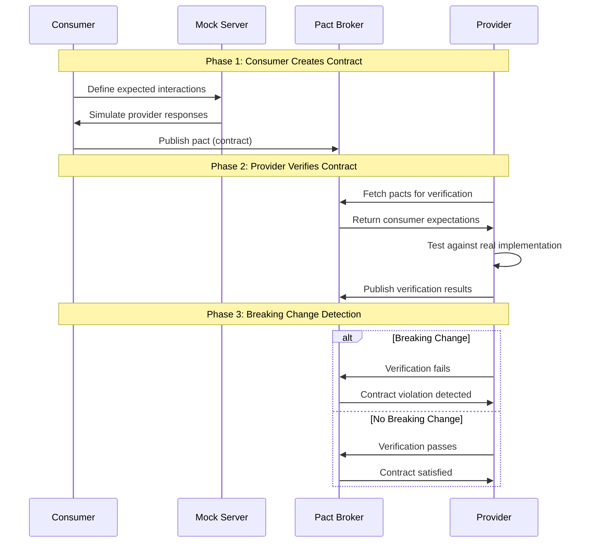

# Contract Testing with Pact

A comprehensive example demonstrating Consumer-Driven Contract Testing using Pact in Python with FastAPI and aiohttp.

## What is Contract Testing?

Contract testing is a technique for testing the integration points between services (consumers and providers) by verifying that both sides of the contract are compatible. Unlike integration tests that test the entire system, contract tests focus on the **interface** between services.

### Why Contract Testing?

- **Early Detection**: Catch breaking changes before they reach production
- **Confidence**: Refactor with confidence knowing contracts will catch issues
- **Documentation**: Contracts serve as living documentation of API expectations
- **Consumer-Driven**: The consumer drives what the API should look like

## How Pact Testing Works

### 1. Consumer-Driven Approach (Consumer Comes First)

```
┌─────────────────┐    Defines Expectations    ┌─────────────────┐
│   Consumer      │ ─────────────────────────► │   Pact Broker   │
│   (API Client)  │                            │   (Contract     │
│                 │                            │   Repository)   │
└─────────────────┘                            └─────────────────┘
         │                                             │
         │ Creates Pact                                │ Stores Contract
         │ (Contract)                                  │
         ▼                                             ▼
┌─────────────────┐                            ┌─────────────────┐
│   Mock Server   │                            │   Provider      │
│   (Simulates    │                            │   (API Server)  │
│   Provider)     │                            │                 │
└─────────────────┘                            └─────────────────┘
```

### 2. Contract Testing Flow

1. Consumer defines it's expectation and mock the provided response using Mock Server provided by Pact, which generates the contract file.
2. Consumer publishes the generated contracts to the Pact Broker which acts like a storage for keeping and sharing different contract versions between the consumer and provider.
3. Provider talks to the broker and verifies the contract states or scenarios with it's own mocked version of actual endpoint, defined in `/_pact/provider_states`.
4. Finally, Provider publishes the verification result to the broker.



### 3. Breaking Change Detection

```
┌──────────────────────────────────────────────────────────┐
│                    Consumer Test                         │
│  ┌─────────────────┐    ┌─────────────────┐              │
│  │   API Client    │───►│   Mock Server   │              │
│  │                 │    │                 │              │
│  │ Expects:        │    │ Simulates:      │              │
│  │ - service       │    │ - service       │              │
│  │ - version       │<---│ - version       │              │
│  │ - build         │    │ - build         │              │
│  └─────────────────┘    └─────────────────┘              │
└──────────────────────────────────────────────────────────┘
                        │ ✅ PASSED + PUBLISHED TO BROKER
                        ▼
┌──────────────────────────────────────────────────────────-┐
│                  Provider Verification                    │
│  ┌─────────────────┐    ┌─────────────────┐               │
│  │   Pact Broker   │───►│   Real Provider │               │
│  │                 │    │                 │               │
│  │ Expects:        │    │ Returns:        │               │
│  │ - service       │    │ - service       │               │
│  │ - version       │<---│ - version       │               │
│  │ - build         │    │ - no build      │               │
│  └─────────────────┘    └─────────────────┘               │
└───────────────────────────────────────────────────────────┘
                              │ ❌ FAILS (build is required)
                              ▼
                    Breaking Change Detected!
```

## Project Structure

```
contract-testing-poc/
├── src/
│   ├── consumer/                    # API Client (Consumer)
│   │   ├── sync_service_client.py  # HTTP client for provider
│   │   ├── test_sync_service_consumer.py  # Consumer tests
│   │   ├── pacts/                  # Generated pact files
│   │   └── pact-logs/              # Pact test logs
│   └── provider/                   # API Server (Provider)
│       ├── main.py                 # FastAPI application
│       ├── sync_controller.py      # API endpoints
│       ├── test_sync_provider.py   # Provider verification tests
│       └── pact-logs/              # Verification logs
├── scripts/                        # Build and test scripts
├── docker-compose.yml              # Pact Broker setup
├── Makefile                        # Project commands
└── requirements.txt                # Python dependencies
```

## Quick Start

### Prerequisites
- Python 3.11+
- Docker and Docker Compose
- Make (optional, but recommended)

### 1. Start the Pact Broker
```bash
# Start the Pact Broker (contract repository)
make start-broker
```
This starts a Pact Broker at `http://localhost:9292` where contracts are stored and shared.

### 2. Install Dependencies
```bash
# Install Python dependencies
make install
```
This command:
1. Creates new virtual environment `.venv`
2. Install necessary dependencies from `requirements.txt` file

Recommended: `make init`
> You can also run `Step 1` and `Step 2` together with `make init`
> It also cleans up existing pact files 

### 3. Run Consumer Tests
```bash
# Run the consumer tests to generate the contracts and publish to the broker
make test
```
This command:
1. Cleans previous pact files
2. Runs consumer tests (creates contracts)
3. Publish the contracts to the Broker

### 4. Run Provider Tests
```bash
# Run provider tests to verify published contracts as well as push the verification result to the broker
make verify
```

This command:
1. Runs provider verification (test contracts against real API)
2. Publish verification result to the broker

## Available Commands

### Basic Commands

```bash
# Recommended for initial setup
make init 

# Start Pact Broker
make start-broker

# Stop Pact Broker
make stop-broker

# Install dependencies
make install

# Clean pact files
make clean-pacts
```

### Testing Commands

```bash
# Run consumer tests only and publish contracts to the broker
make test

# Run provider verification only
make verify
```

### Deployment Commands

```bash
# Check if consumer can be deployed
make can-i-deploy-consumer

# Check if provider can be deployed
make can-i-deploy-provider

# Deploy consumer
make deploy-consumer

# Deploy provider
make deploy-provider
```

## Understanding the Tests

### Consumer Test Example
This includes
1. Creating Mock Server
2. Configuring Broker with `publish_to_broker=True`
3. Feed the mock server with response that the consumer expects from the provider
4. Assert the response from the mock server

```python
# import all necessary pact components
from pact import Consumer, Provider, Term, Format, Like, Pact

# Create Pact Mock Server
@pytest.fixture(scope="session")
def mock_server(
    # Fixtures
    pact_dir,
    pact_log_dir,
    broker_opts,
    contract_version,
    contract_branch
):
    pact: Pact = Consumer(
        CONSUMER_NAME,
        version=contract_version,
        branch=contract_branch
    ).has_pact_with(
        provider=Provider(PROVIDER_NAME),
        host_name=MOCK_SERVER_HOST,
        port=MOCK_SERVER_PORT,
        broker_base_url=PACT_BROKER_URL,
        broker_username=PACT_BROKER_USERNAME,
        broker_password=PACT_BROKER_PASSWORD,
        publish_to_broker=True,  # This is important to publish contracts right away
    )
    try:
        pact.start_service()
        yield pact
    finally:
        pact.stop_service()

@pytest.mark.contract
@pytest.mark.asyncio
async def test_get_version(mock_server):
   # Consumer defines what it expects from the provider
   expected_version = {
      'service': Term(
          matcher=r'^sync-service$',
          generate='sync-service'
      ),
      'version': Term(
          matcher=r'^\d+(.\d+){2,3}$',
          generate='1.0.0'
      ),
      'build': Term(
          matcher=r'^\d{8}-[a-f0-9]+$',
          generate='20240101-abc123'
      )
   }
   
   # Feed the mock server with expected response from /version endpoint.
   # This is crucial because it generates the contract and acts as a mock provider
   (
      mock_server
      .given('sync-service is running')
      .upon_receiving('a request for version information')
      .with_request(
          method='GET',
          path='/version'
      )
      .will_respond_with(
          status=200,
          headers={'Content-Type': 'application/json'},
          body=Like(expected_version)
      )
   )
   
   # Test against mock server
   with mock_server:
      resp = await client.get_version()
      # assert response
      assert resp.service is not None and isinstance(resp.service, str)
      assert resp.version is not None and isinstance(resp.version, str)
      assert resp.build is not None and isinstance(resp.build, str)
      assert resp.service == 'sync-service'
       
```
Checkout the full code example here: https://github.com/dipanjal/contract-testing-poc/blob/main/src/consumer/test_sync_service_consumer.py

### Provider Verification Example
This includes:
1. Fetch contracts from the Broker
2. Cross-match contract states / scenarios with provider states from endpoint `/_pact/provider_states`
3. Assert verification result `SUCCESS=0` and `FAIL=1`
4. Publish the verification result to the Broker

```python
# Provider verifies against real implementation
verifier = Verifier(
    provider="sync-service",
    provider_base_url="http://localhost:5000"
)

result = verifier.verify_with_broker(
    broker_url="http://localhost:9292",
    # ... other options
)
assert result == 0  # Passes if no breaking changes
```

Checkout the full code example here: https://github.com/dipanjal/contract-testing-poc/blob/main/src/provider/test_sync_provider.py

## Breaking Change Scenarios
If any response schema change in the `Provider` doesn't match with the contract published by the `Consumer`,
it will be considered as a **BREAKING CHANGE!**

This check can be done by verifying teh Provider after schema changes.
```bash
# verify the provider after response schema changed
make verify
```

### 1. Removing a Required Field

**Before:**
```json
{
  "service": "sync-service",
  "version": "1.0.0",
  "build": "20240101-abc123",
  "timestamp": "2025-07-24T15:43:24.204757Z"
}
```

**After (Breaking Change):**
```json
{
  "service": "sync-service",
  "version": "1.0.0",
  "timestamp": "2025-07-24T15:43:24.204757Z"
  // build removed - BREAKING CHANGE!
}
```

**Result:** ❌ Provider verification fails

### 2. Changing Field Type

**Before:**
```json
{
  "build": "20240101-abc123"  # String
}
```

**After (Breaking Change):**
```json
{
  "build": 20240101  # Number - BREAKING CHANGE!
}
```

**Result:** ❌ Provider verification fails

### 3. Removing Unnecessary Field 
**Before:**
```json
{
  "service": "sync-service",
  "version": "1.0.0",
  "build": "20240101-abc123",
  "timestamp": "2025-07-24T15:43:24.204757Z"
}
```
**After:**
```json
{
  "service": "sync-service",
  "version": "1.0.0",
  "build": "20240101-abc123"
  // timestamp removed - NON BREAKING CHANGE
}
```

**Result:** ✅Provider verification succeeded

If you take a look at the contract published by the consumer http://localhost:9292/pacts/provider/sync-service/consumer/transaction-service/latest
You will see, consumer don't expect to have `timestamp` in the response.
Therefore, any removal or changes in the `timestamp` field wouldn't break our consumer code. 

## Best Practices

### 1. Consumer-Driven Design
- Let consumers define what they need
- Providers should adapt to consumer requirements
- Use contracts as living documentation

### 2. Backward Compatibility
- Always make changes backward compatible
- Use optional fields for new features
- Version APIs when breaking changes are necessary

### 3. Contract Evolution
- Add new fields as optional
- Deprecate old fields gradually
- Communicate changes to all consumers

### 4. Testing Strategy
- Run consumer tests in CI/CD
- Run provider verification before deployment
- Use "can-i-deploy" checks for safety

## Troubleshooting

### Common Issues

1. **Pact Broker Not Running**
   ```bash
   make start-broker
   ```

2. **Provider Service Not Running**
   ```bash
   # Check if service is running on port 5000
   curl http://localhost:5000/health
   ```

3. **Authentication Issues**
   - Default credentials: `pactbroker` / `pactbroker`
   - Check `envs/local.env` for demo configuration

4. **Test Failures**
   - Check pact logs in `src/*/pact-logs/`
   - Verify provider is returning expected schema
   - Ensure all required fields are present

### Debug Mode

```bash
# Run with verbose logging
PACT_LOG_LEVEL=DEBUG make contract-test
```

## Advanced Configuration

### Environment Variables

```bash
# Pact Broker Configuration
PACT_BROKER_URL=http://localhost:9292
PACT_BROKER_USERNAME=pactbroker
PACT_BROKER_PASSWORD=pactbroker

```

## Contributing

1. Fork the repository
2. Create a feature branch
3. Make your changes
4. Add tests for new functionality
5. Ensure all contract tests pass
6. Submit a pull request

## License

This project is licensed under the MIT License - see the [LICENSE](LICENSE) file for details.

## Resources

- [Pact Documentation](https://docs.pact.io/)
- [Pact Python Library](https://github.com/pact-foundation/pact-python)
- [Contract Testing Best Practices](https://docs.pact.io/implementation_guides/best_practices)
- [Consumer-Driven Contracts](https://martinfowler.com/articles/consumerDrivenContracts.html)
